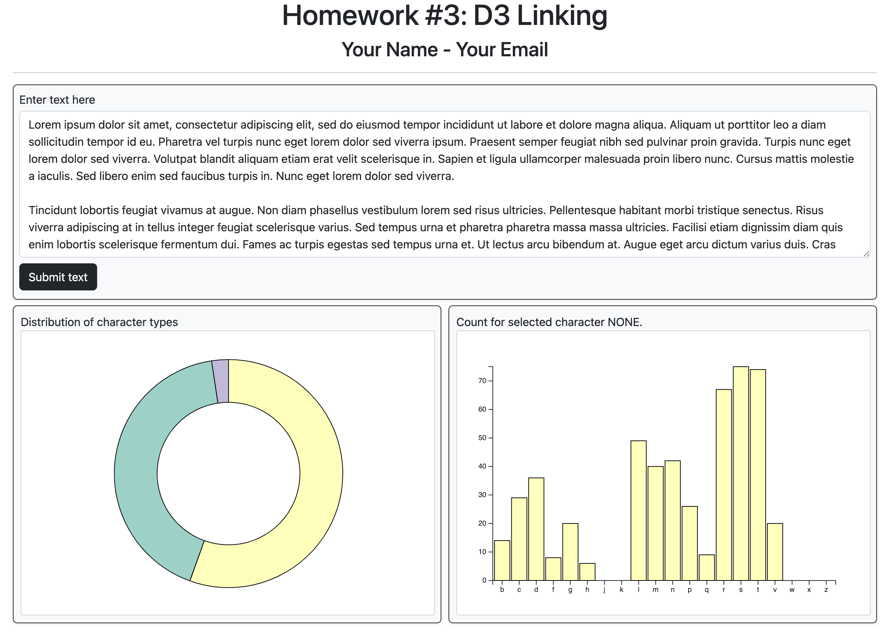
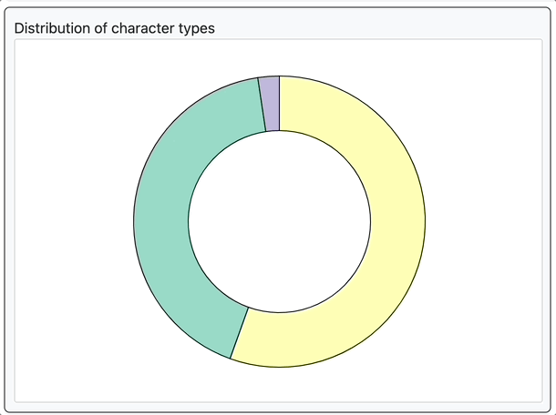
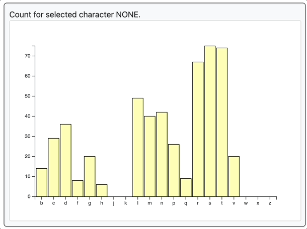

# Homework #3: Linking Charts and Adding Interactivity

The purpose of this homework is to give you practice interactively building and linking visualizations together in D3. By the end of this assignment you should be able to:

- Dynamically create and parse a string dataset in JavaScript
- Plot values in a donut chart
- Plot values in a bar chart
- Dynamically update a chart based on user interactions
- Add a tooltip

The screenshot below shows an example of what your finished interface will look like.



## Overview

The starter code for this assignment shows three panels on the `index.html` page. The top panel contains a `textarea` html element and a `submit` button. The user can enter a set of text and then click the button. This should create a donut chart in the bottom-left panel. The donut chart will visualize the distribution of the entered text characters based on their type (i.e., one arc will show the percentage of consonants in the text, another will show the percentage of vowels, and the last will show the percentage of punctuation). Clicking a donut arc will show the counts of the selected characters in a bar chart.

## Data Description

The text entered into the `textarea` element will consitute the data for your visualizations. You should assume that the entered characters will be of the following types. 
- consonants
- vowels
- punctuation (specifically: period, comma, question mark, exclamation mark, colon, and semi-colon)

You may ignore other characters, including spaces, line breaks, tabs, and other symbols like $, @, ", etc.

As an example, if the user submits the following as their text:

```html
 Lorem Ipsum Dolor Sit Amet! Consectetur Adipiscing elit?
```

You would count the number of times each vowel appears in the submitted text:

```
a: 2, e: 5, i: 6, o: 4, u: 2, y: 0
 ```

Note that I'm storing the vowels in a case-insensitive manner! Count and store the vowerls to a data structure, and create corresponding data structures for the consonants (also case-insensitive) and punctuation characters in the text. (Alternatively, you could also create one big data structure. It's up to you how you want to process your data.) Also, for the purposes of this assignment, the letter `y` can always be considered as a vowel.

You can consider testing using random text generators, such as [https://loremipsum.io/generator](https://loremipsum.io/generator) when working on your page. 

## To complete the assignment

- Clone this code template to your local machine.
- Start a local server and open the `index.html` page.
- Modify the given code according to the instructions below to achieve the requested interface.
- Commit and push the code back to this repository to submit it.

## Step 0: Starting code

When you first run the page, you should see the empty interface. Add your name and email to the top. It's up to you if you want to write your JavaScript code in a separate JS file, or in the main `index.html` file.

## Step 1: Displaying a donut chart

When the user clicks on the `Submit` button, you should display a donut chart with three arcs that show the distrubution of grammar characters from the `textarea` (i.e., the percentage of vowels, the percentage of consonants, and the percentage of punctuations in the entered text).

- You'll want to first read the entered text from the `textarea` and store it in a set of one or more data structures. Every time the submit button is pressed, you'll need to clear and recreate these.
- Your donut chart should be centered inside the `#pie_div` svg. You may choose the size of the rings (inner and out radius), but make sure the donut does not go outside of the `svg`'s bounds, and also that the rings are not too fat/skinny.
- Choose a categorical d3 color scale for this chart by picking a color scale from [https://github.com/d3/d3-scale-chromatic](https://github.com/d3/d3-scale-chromatic). For my screenshots, I'm using the `d3.schemeSet3` scale, but you can choose any categorical scale you like.
- Give the arcs in this chart a 1 pixel black border (i.e., `stroke-width=1`).
- When the user mouses over an arc in the donut chart, perform two actions: (1) First, emphasize the currently hovered arc by increasing its border thickness from 1 to 4 pixels. (2) Second, centered in the inside of the donut, show the count of the selected character type, as shown in the below gif. Make sure that the font size you choose is legible, and that it fully fits inside the inner ring (you can assume we won't test a count higher than 999). When the user mouses off of the arc, make the border go back to a thickness of 1, and clear the inside text (i.e., make it blank inside the donut chart).

| 🔍 **Hint:** Here's two examples of making donut charts: [https://observablehq.com/@d3/donut-chart](https://observablehq.com/@d3/donut-chart), [https://embed.plnkr.co/plunk/Zfv7x6](https://embed.plnkr.co/plunk/Zfv7x6). Note that the second chart uses an older version of D3, but the syntax is similar.

| 🔍 **Hint:** When you mouse over an arc, you want to select the currently hovered arc. Inside your `mouseover`/`mousemove`/`mouseout` functions, `this` will return a reference to the arc element in the DOM. You might also consider calling these functions like so: `.on('mouseover', function(d, i) { ...})`. Use the Dev Tools to see what the `d` and `i` objects are, and what properties they contain, as a way to figure out how to reference the data item that is currently part of the event.



## Step 2: Displaying a linked bar chart

When the user clicks on an arc in the donut chart, draw a bar chart in the bottom right panel. The bar chart should be centered in the panel (with a reasonable margin, similar to the screenshot above), and show the counts of characters based on the arc that the user clicked on. For example, if you click on the consonants arc in the donut chart, the bar chart will show the count of b's, c's, d's, etc., as shown in the below gif.

- The bars in the bar chart should be the same color as the arc that was clicked on in the donut chart. In my example below, consonants in the donut chart are yellow, so clicking on them will load the bar chart a yellow color; clicking another arc will change the color of the bars. It's also okay to give a bit of padding between the bars, like what I show in the screenshots (though this is optional). However, you should give the bars a 1 pixel thick black border.
- If the user clicks on a different arc in the donut chart, re-load the bar chart for that arc (with the appropriate color). You'll need to recompute the axes. The y-axis should go from 0 to whatever the max is for your current selection, and the x-axis will show the newly selected characters. (The vowels and consonnants are ordered alphabetically. The ordering for the punctuation symbols is up to you.)
- If the user clicks the `submit` text button in the top panel (thus submitting a new set of text, and re-loading the donut chart), clear the bar chart.

## Step 3: Add a hover tooltip to the bar chart

Finally, let's add a tooltip to the bar chart. When the user hovers over a bar, we'll display the exact count for that character.

The tooltip should show the current letter that's being hovered and its count, styled like the below gif (e.g., white background, black rounded border with a width of 2 pixels). The tooltip should follow the user's mouse as it moves along the bar, and disappear when it's no longer over the bar. You'll want to use mouse events to control this functionality (`mouseover`, `mousemove`, `mouseout`). 

| 🔍 **Hint:** There are multiple ways to implement tooltips. One option is defining a div that's hidden unless you are hovering over a bar; when that happens, you populate the div with the necessary info, change its display to visible, and move it to the appropriate position on the so it follows the mouse's x/y position on the page. See  this page which for an example: [https://bl.ocks.org/d3noob/97e51c5be17291f79a27705cef827da2](https://bl.ocks.org/d3noob/97e51c5be17291f79a27705cef827da2).



## Grading

This assignment is worth 10 points.

- Step 0 is worth 1 point
- Step 1 is worth 3 points
- Step 2 is worth 3 points
- Step 3 is worth 3 points

This assignment does not have any extra credit options.