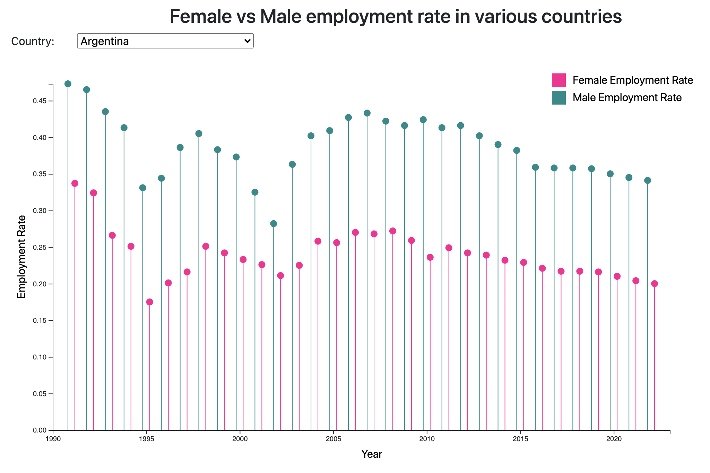

# Homework #2: D3 Simple

The purpose of this homework is to teach you some basic grammar and functionalities contained in D3.js:

* Loading two datasets
* Performing DOM selection
* Filtering data attributes
* Dynamically update visualized attributes
* Creating axes
* Adding a legend
* Using the D3 domain, range, and scale functions
* Adding axis labels
* Creating circles and lines in svg

The starter codes for homework assignments uses D3 v7. You should use D3 v7 for your homeworks and project. If you are referencing online code tutorials, keep in mind that syntax may slightly change between versions! Be sure to also check the latest D3 documentation.

## Data and Chart Description

This assignment uses two csv files in the `dataset/` folder: `females_data.csv` and `males_data.csv`. From 1991 to 2022, these list a series of countries and their corresponding female and male employment rates respectively. In the visualization that you create (see image below), there will be a dropdown listing 5 countries; when the user changes the country in the dropdown, that country's employment rate will be shown for males and females using a lollipop chart.

## To start the assignment

* Clone this code to your local machine.
* Using a local server (such as HTTP Simple Server), open the **index.html** file. Remember, homeworks will be graded using Firefox and Python's HTTP Simple Server.
* Modify the source code according to the instructions below.
* Commit and push the code back to this repository to submit your assignment. The finished page in `index.html` should look like this:

## Assignment Steps

### Step 0: 
In the HTML file's `head` section, add your name and email.

### Step 1:
In the HTML file, there is a div with the id `my_dataviz`. Create an `svg` element inside this div. The `svg` should have a width of 1000 px and a height of 600 px.

> 🔍 **Note:** You can add the `svg` directly in the HTML or via Javascript in the `js/main.js` file.

### Step 2:
Create a `select` dropdown element in `index.html` inside the `div` element with a class `col-3`, and add 5 countries from the dataset as options for the dropdown. Use CSS to make the width of the select 100% for the `div` that it's inside. Then, add code so that, when the country in the `select` is changed, the draw lollipop chart function in `js/main.js` will be called.

> 🔍 **Hint:** There's multiple ways to do this! For example, you could add an `onchange` event, or create an event listener using Javascript. 

### Step 3:
In `main.js`, the males and females csv files are loaded. Once the data is loaded,  store it in one or more global variables so that when the country changes we don't need to load the datasets again.

Since D3 doesn't have any information about the attribute types of the new files, it interprets every data value as a string. To use the quantatitive columns as such, you'll need to do some data wrangling to convert each row of the data to the correct numeric format. For your 5 selected countries, change the attribute type from string to numeric. D3's data loading functions (e.g. d3.csv) have a provision for that, which is documented [here](https://github.com/d3/d3-fetch/blob/master/README.md). You can also do the converting after you have loaded the data.

### Step 4:
Next, create the x- and y-axes for your chart. The x-axis will show years, so we will use a `d3.scaleTime` for it. The y-axis will show employment rate, so we will use `d3.scaleLinear`. The y-axis range will be 1990-2023 (the data goes from 1991-2022, but we're adding 1 year padding on each end), and the x-axis range will be 0 to the maximum employment rate value (either male or female, whichever is highest) for the currently selected country over the time period.

> 🔍 **Hint:** You'll need to use D3 `range` and `domain` to do this.

> 🔍 **Hint:** `d3.scaleTime` operates on Javascript `Date` objects, not numbers! Convert your start and end year values to `Date` objects when adding them to the domain.

### Step 5:
We want to visualize the relationship of male and female employement rates in selected country from 1991 to 2022, in order to observe how this relationship has changed over the time period of our dataset. For this we will create a [lollipop chart](https://datavizproject.com/data-type/lollipop-chart/). A lollipop chart is similar to a bar chart, but instead of using rectangles to show data values, it shows lines with circles at the top.

For each year in dataset, you should show two different colored lines, one for male and another for female. You can pick the colors you want to use, but they should be easily distinguishable. Append a circle at the top of each line for both male and female to create lollipop visualization.

> 🔍 **Hint:** Since your x-scale uses Javascript `Date` objects, you should convert your year values to Date objects to correctly call your x scale. You can do this operation here, or when you do your data wrangling in Step 3 (instead of converting to numerics, convert to `Date` objects).

> 🔍 **Hint:** You don't want the two lollipops for a year to overlap, so give them each a small amount of offset. In the image above, the male lollipop for each year is offset left 5 pixels, and the female lollipop is offset right 5 pixels.

> 🔍 **Hint:** Give a bit of margin around the outside of your chart so your objects don't run off the edge of the `svg`.

### Step 6:
It’s important to help your audience understand what is going on in the chart. To do this, add a legend at the upper right corner of the chart. The legend should have a square showing the colors, with labels reading "Female Employment Rate" and "Male Employment Rate". Then add titles for your x-axis and y-axis: "Year" for the x-axis and a rotated "Employment Rate" for the y-axis.

### Step 7:
As a final step, make the chart interactive. When the user updates the country value in the drop down, the chart should be redrawn to show the values for the newly selected country.

Once you are finished with Step 7 and you have your chart looking similar to the screenshot above, you are done! Be sure to commit and push your completed code by the deadline.

### Extra Credit:

Instead of simply redrawing the chart in Step 7 when a user selects a different country, use D3 transitions to animate each lollipop from the old to new values (that is, either growing or shrinking). This step is worth +2 extra credit points.

---

## Grading

This assignment is worth 10 points.
- (1 pt each) Steps 0, 1, 2, 3, 6, and 7
- (2 pts each) Steps 4 and 5
